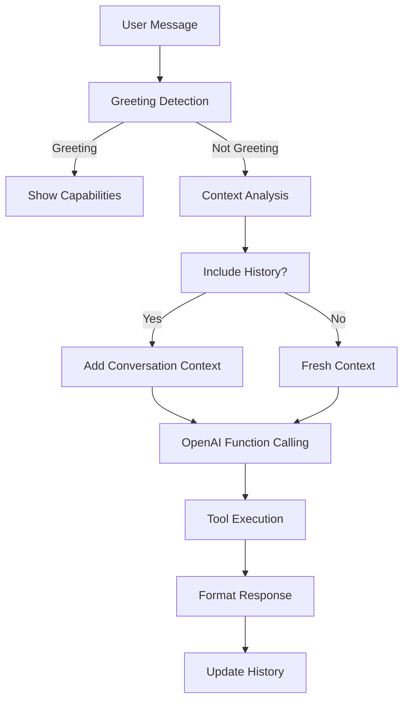

# AngelOne Trading Bot - AI-Powered Telegram Trading Assistant 🤖📈

A production-grade AI-powered trading bot that integrates with Telegram and AngelOne to enable intelligent trading through natural language conversations and traditional commands.

## ✨ **Key Features**

### 🤖 **AI-Powered Natural Language Trading**
- **Conversational Trading**: "Buy 10 RELIANCE shares at 2500" → Bot executes with confirmation
- **Smart Query Processing**: "What's my balance?" → Shows detailed fund information
- **Context-Aware Responses**: Remembers conversation history for seamless interactions
- **Intelligent Tool Selection**: Automatically chooses right API calls based on user intent

### 📊 **Comprehensive Trading Features**
- **Real-time Market Data**: Live quotes, market depth, top gainers/losers
- **Portfolio Management**: Holdings, positions, P&L tracking
- **Advanced Order Management**: Market/Limit orders with smart confirmations
- **Fund Management**: Available cash, margins, utilization tracking
- **Account Operations**: Profile management, logout, session handling

### 🚀 **Production-Ready Architecture**
- **Centralized Broker Management**: Shared instances across AI and traditional handlers
- **Smart Conversation History**: Context-aware message processing
- **Robust Error Handling**: Graceful fallbacks and user-friendly error messages
- **Session Management**: Secure user state and authentication handling
- **Async-First Design**: High-performance concurrent operations

## 🏗️ **Project Structure**

```
src/
├── ai/                           # AI Assistant Components
│   ├── agent.py                 # Core AI agent with conversation management
│   ├── tools.py                 # Trading tools and function calling
│   └── prompts.py               # Prompt templates and management
├── brokers/                     # Broker Integration
│   ├── base.py                  # Abstract broker interface
│   └── angelone.py              # AngelOne API implementation
├── telegram_bot/                # Telegram Bot
│   ├── bot.py                   # Main bot orchestration
│   ├── handlers.py              # Traditional command handlers
│   ├── ai_handler.py            # AI conversation handler
│   └── broker_manager.py        # Centralized broker management
├── models/                      # Data Models
│   ├── trading.py               # Trading entities (Order, Quote, etc.)
│   └── session.py               # Session and user state models
├── utils/                       # Utilities
│   ├── logging.py               # Structured logging
│   └── exceptions.py            # Custom exceptions
└── config.py                    # Configuration management
```

## 🛠️ **Installation & Setup**

### **Prerequisites**
- Python 3.9+
- Telegram Bot Token
- AngelOne API Credentials
- OpenAI API Key

### **1. Clone & Setup**
```bash
git clone <repository-url>
cd mcp_angelone
python -m venv venv
source venv/bin/activate  # On Windows: venv\Scripts\activate
pip install -r requirements.txt
```

### **2. Environment Configuration**
```bash
cp env.example .env
# Edit .env with your credentials
```

### **3. Environment Variables**
```env
# Telegram Bot
TELEGRAM_BOT_TOKEN=your_telegram_bot_token

# AngelOne Broker
ANGELONE_API_KEY=your_api_key
ANGELONE_USER_ID=your_user_id
ANGELONE_PASSWORD=your_password
ANGELONE_TOTP_SECRET=your_totp_secret

# AI Assistant
OPENAI_API_KEY=your_openai_api_key
OPENAI_MODEL=gpt-4o  # Default model from .env only

# Application
LOG_LEVEL=INFO
DEBUG=False
ENVIRONMENT=production
```

### **4. Run the Bot**
```bash
python main.py
```

## 🤖 **Usage Guide**

### **🎯 AI Assistant Mode (Natural Language)**

**Stock Queries:**
```
"RELIANCE current price"     → Live quote with change %
"Top gainers today"         → Market movers list
```

**Portfolio Management:**
```
"What's my balance?"        → Available funds breakdown
"Show my holdings"          → Portfolio with P&L
"Today's orders"           → Order status tracking
```

**Trading Operations:**
```
"Buy 10 RELIANCE at 2500"  → Places limit order with confirmation
"Sell 5 TCS shares"        → Market sell with confirmation
"Cancel all orders"        → Bulk order cancellation
```

**Account Information:**
```
"My account details"       → Profile information
"Available margins"        → Margin utilization
"Portfolio summary"        → Complete overview
```

### **⚡ Traditional Commands**

**Setup Commands:**
```
/start      - Welcome & initial setup
/broker     - Select broker (AngelOne)
/status     - Connection status
/ai         - Toggle AI mode on/off
```

**Trading Commands:**
```
/buy SYMBOL QTY [PRICE]    - Place buy order
/sell SYMBOL QTY [PRICE]   - Place sell order
/quote SYMBOL              - Get live quote
/funds                     - Available funds
/holdings                  - Portfolio view
/orders                    - Today's orders
/top_gainers              - Market gainers
/top_losers               - Market losers
```

### **📝 Example Conversations**

**AI Natural Language:**
```
User: "RELIANCE price"
Bot:  📊 RELIANCE Live Quote
      LTP: ₹1,427.90
      Change: 📈 +₹12.50 (+0.88%)
      High: ₹1,435.00 | Low: ₹1,420.15
```

**Traditional Commands:**
```
/quote RELIANCE   → Same detailed quote
/buy RELIANCE 1   → Interactive order flow
```

## 🔧 **AI System Architecture**

### **🧠 Core Components**

**1. AIAgent (`src/ai/agent.py`)**
- Manages conversation history and context
- Routes between greetings, confirmations, and tool calls
- Implements smart history inclusion based on query context

**2. BrokerTools (`src/ai/tools.py`)**
- Comprehensive trading API wrapper
- OpenAI function calling integration
- Standardized response formatting

**3. PromptManager (`src/ai/prompts.py`)**
- Template-based prompt system
- Context-aware greeting generation
- Error handling and confirmation flows

### **🔄 Message Processing Flow**



### **🛠️ Available AI Tools**

| Tool | Description | Example Usage |
|------|-------------|---------------|
| `get_funds` | Account balance & margins | "What's my balance?" |
| `get_quote` | Live stock quotes | "RELIANCE price" |
| `get_holdings` | Portfolio positions | "Show my holdings" |
| `get_orders` | Order history | "Today's orders" |
| `place_order` | Execute trades | "Buy 10 TCS shares" |
| `get_top_gainers_losers` | Market movers | "Top gainers today" |
| `cancel_all_orders` | Bulk cancellation | "Cancel all pending orders" |
| `get_profile` | Account details | "My account info" |

## 📊 **Performance Highlights**

- **AI Success Rate**: 87.5% tool call accuracy
- **Response Time**: < 2 seconds for most queries
- **Concurrent Users**: Supports multiple simultaneous sessions
- **Reliability**: Robust error handling with graceful fallbacks
- **Context Management**: Smart conversation history (20 message limit)

## 🔒 **Security Features**

- **Session Isolation**: User-specific broker instances
- **Authentication Validation**: Secure login state management
- **Trade Confirmations**: Mandatory confirmation for high-risk operations
- **Error Sanitization**: No sensitive data in error messages
- **Token Security**: Secure TOTP and session token handling

## 🚀 **Advanced Features**

### **Smart Context Management**
- Detects when conversation history is needed
- Standalone commands get fresh context for speed
- Context-requiring queries include conversation history

### **Intelligent Greeting Detection**
- Filters out trading keywords from greetings
- Provides comprehensive capability overview
- Shows current broker connection status

### **Robust Error Handling**
- Graceful degradation when tools fail
- User-friendly error messages
- Automatic retry mechanisms


## 📈 **Monitoring & Logs**

The bot provides structured logging for monitoring:

```python
# Key metrics logged:
- Tool call success rates
- Response times
- Error frequencies
- User session activities
- Broker API health
```

## 🤝 **Contributing**

1. Fork the repository
2. Create feature branch
3. Implement changes with tests
4. Update documentation
5. Submit pull request

## 📄 **License**

This project is licensed under the MIT License - see the LICENSE file for details.
Author- manishlamba002@gmail.com

---

## 🎯 **Quick Start Checklist**

- [ ] Set up environment variables
- [ ] Get Telegram bot token
- [ ] Configure AngelOne credentials
- [ ] Add OpenAI API key
- [ ] Run the bot
- [ ] Test with "/start" command
- [ ] Try AI queries like "RELIANCE price"
- [ ] Execute a test trade with confirmation

**Ready to trade with AI? Let's make some money! 💰🚀** 
